# KnowHub: Scalable Knowledge Sharing Platform System Design Report
**Author:** Senior System Architect (Google/Meta)  
**Document Reference:** KH-SDR-2026-V1  
**Classification:** Enterprise System Architecture Specification  
**Target Audience:** University System Design Evaluation Board & Engineering Staff  

---

## Executive Summary
This report presents the system architecture design for **KnowHub**, a large-scale, high-performance knowledge-sharing platform (similar to Quora, Reddit, and Stack Overflow). The architecture targets low-latency content delivery, high write-throughput, semantic search capability, and personalized feeds.

The design utilizes a **polyglot microservices architecture** with a **hybrid SQL + NoSQL database layer** and an **event-driven processing pipeline**. The system is designed to support 100M MAU and 10M DAU with 99.99% availability, sub-200ms feed latency ($p99$), and sub-100ms global search latency.

---

## SECTION 1: REQUIREMENTS ANALYSIS

Designing a platform of this scale requires translating business requirements into technical metrics.

```
+-------------------------------------------------------------------------------+
|                             SYSTEM PROFILE SUMMARY                             |
+-------------------+-------------------+-------------------+-------------------+
|      Metric       |   Average Value   |    Peak Value     |    Growth Plan    |
+-------------------+-------------------+-------------------+-------------------+
| DAU               | 10,000,000        | 10,000,000        | Scale to 100M DAU |
| Read QPS          | 5,787 QPS         | 17,361 QPS        | CDN & Redis caches|
| Write QPS         | 146 QPS           | 438 QPS           | Kafka buffers     |
| Read/Write Ratio  | 40:1 (Read-Heavy) | 40:1 (Read-Heavy) | Decoupled CQRS    |
| Storage Required  | 7.54 TB (Raw)     | 22.6 TB (Replica) | 5-Year retention  |
+-------------------+-------------------+-------------------+-------------------+
```

### Functional Requirements (FR)
1. **User Management**: Authentication, profiles, and reputation metrics.
2. **Q&A Lifecycle**: Create questions, write answers, comment on posts, and vote (upvote/downvote).
3. **Interest Graph**: Follow users and topics (categories).
4. **Feeds**: Deliver a personalized chronological and recommender-driven home feed.
5. **Search**: Search questions using keyword and semantic matching.
6. **Notifications**: Real-time pushes for content interactions.
7. **Analytics**: Log user activity and views.

### Non-Functional Requirements (NFR)
1. **High Availability**: $99.99\%$ uptime (maximum 52.6 minutes of downtime per year).
2. **Low Latency**: Feed retrieval latency must satisfy $p99 \le 200\text{ms}$. Search query response must satisfy $p99 \le 100\text{ms}$.
3. **Scalability**: Support horizontal scaling of CPU, memory, and database instances.
4. **Consistency**: Follow eventual consistency for read paths (feeds, comments, search), and strict consistency (ACID) for authentication, writes, and reputation transactions.
5. **Fault Tolerance**: The system must tolerate individual microservice failures, network partitions, and database master crashes without losing data.

### Capacity Estimation (For 10M DAU)

#### A. Traffic Estimation
* **Daily Active Users (DAU)**: $10,000,000$.
* **Read Actions**: Average of $50$ page/feed reads per active user daily.
  $$\text{Total Reads/Day} = 10,000,000 \times 50 = 500,000,000 \text{ reads/day}$$
  $$\text{Average Read QPS} = \frac{500,000,000}{86400} \approx 5,787 \text{ QPS}$$
  $$\text{Peak Read QPS (3x Average)} = 5,787 \times 3 \approx 17,361 \text{ QPS}$$

* **Write Actions**:
  * Questions: $100,000$ posts/day.
  * Answers: $500,000$ posts/day.
  * Comments: $2,000,000$ comments/day.
  * Votes: $10,000,000$ votes/day.
  * Total Writes: $12,600,000$ writes/day.
  $$\text{Average Write QPS} = \frac{12,600,000}{86400} \approx 146 \text{ QPS}$$
  $$\text{Peak Write QPS (3x Average)} = 146 \times 3 \approx 438 \text{ QPS}$$

* **Read/Write Profile**: Heavily read-intensive ($40:1$ ratio). This requires decoupling read databases from write path workloads.

#### B. Storage Estimation (For 5 Years of Data)
* **User Accounts**: $100\text{M}$ total registered users. Size per profile record $\approx 2\text{KB}$.
  $$\text{User Profiles Storage} = 100,000,000 \times 2\text{KB} = 200\text{GB}$$
* **Questions**: $100,000$ questions/day. Size per question document $\approx 5\text{KB}$.
  $$\text{Questions Storage/Year} = 100,000 \times 365 \times 5\text{KB} = 182.5\text{GB/year}$$
  $$\text{5-Year Questions Storage} = 912.5\text{GB}$$
* **Answers**: $500,000$ answers/day. Size per answer document $\approx 3\text{KB}$.
  $$\text{Answers Storage/Year} = 500,000 \times 365 \times 3\text{KB} = 547.5\text{GB/year}$$
  $$\text{5-Year Answers Storage} = 2.737\text{TB}$$
* **Comments**: $2,000,000$ comments/day. Size per comment $\approx 1\text{KB}$.
  $$\text{Comments Storage/Year} = 2,000,000 \times 365 \times 1\text{KB} = 730\text{GB/year}$$
  $$\text{5-Year Comments Storage} = 3.65\text{TB}$$
* **Social Graph**: $100\text{M}$ users following $20$ people and $10$ topics. Each edge requires $16\text{Bytes}$.
  $$\text{Total Edges} = 100,000,000 \times 30 = 3,000,000,000 \text{ edges}$$
  $$\text{Graph Storage} = 3,000,000,000 \times 16\text{B} = 48\text{GB}$$
* **Total Storage (5 Years)**: $\approx 7.54\text{TB}$ raw data. Factoring indexes, database structures, and a 3-way replication factor, total physical storage required $\approx 22.6\text{TB}$.

---

## SECTION 2: HIGH-LEVEL SYSTEM DESIGN

The system separates read and write operations using a Command Query Responsibility Segregation (CQRS) architecture.

### System Architecture Diagram

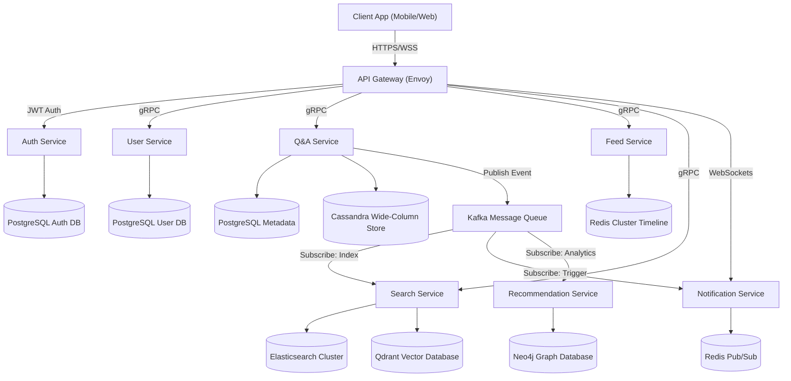

### Components and Responsibilities
1. **API Gateway (Envoy)**: Handles rate limiting, JWT token validation, CORS policies, TLS termination, and request routing to microservices via gRPC.
2. **Kafka Broker**: Handles asynchronous tasks (indexing, updates, metrics collection, push notifications), isolating client requests from database write operations.
3. **Redis Cluster Caching**:
   * **Cache-Aside Caches**: Stores user profiles.
   * **Write-Through Caches**: Stores pre-computed feeds for active users.
   * **Redis Pub/Sub**: Manages WebSockets notifications.
4. **Polyglot Database Tier**:
   * **PostgreSQL**: Stores relational data requiring transactional integrity (accounts, billing, question metadata).
   * **Cassandra**: Manages high-write partition workloads (answers, comments) without relational JOIN locks.
   * **Neo4j**: Graph database that resolves user relationships and topic graphs.
   * **Elasticsearch & Qdrant**: Elasticsearch handles lexical keyword matching, while Qdrant performs semantic vector distance searches.

### End-to-End User Flow (Write to Read)

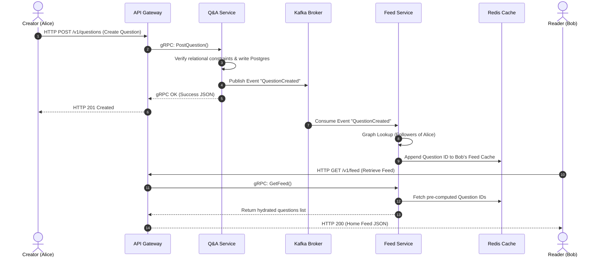

---

## SECTION 3: MICROSERVICES DESIGN

The backend consists of stateless, decoupled services communicating via gRPC or asynchronous Kafka events.

```
+------------------+-----------------------+-------------------+--------------------+
|   Service Name   |  Database Ownership   | Inbound Interface |  Scaling Strategy  |
+------------------+-----------------------+-------------------+--------------------+
| User Service     | PostgreSQL (User DB)  | gRPC              | CPU Auto-scaling   |
| Auth Service     | PostgreSQL (Auth DB)  | gRPC / HTTPS      | Horizontal scale   |
| Question Service | PostgreSQL (Metadata) | gRPC / Kafka      | Read Replicas      |
| Answer Service   | Cassandra (Answers)   | gRPC              | Partition Tuning   |
| Comment Service  | Cassandra (Comments)  | gRPC / HTTPS      | Cluster scaling    |
| Vote Service     | Redis / Kafka         | gRPC / Kafka      | Memory scaling     |
| Topic Service    | Neo4j (Graph DB)      | gRPC              | Read Replicas      |
| Feed Service     | Redis Cluster         | gRPC / Kafka      | Sharding Memory    |
| Recommendation S | Neo4j / Spark ML      | Kafka / Spark     | Worker Pools       |
| Search Service   | ES / Qdrant           | gRPC / Kafka      | Index Clustering   |
| Notification S   | Redis Pub/Sub         | WebSockets / Kafka| Socket Pools       |
| Analytics S      | ClickHouse            | Kafka / Analytics | Cluster Node Add   |
+------------------+-----------------------+-------------------+--------------------+
```

### 1. User Service
* **Responsibilities**: User profile management, registration, and reputation updates.
* **Database**: PostgreSQL User Database.
* **Communication**: Inbound gRPC, outbound Kafka events (`UserUpdatedEvent`).
* **Scaling Strategy**: Scaled horizontally using CPU load metrics.

### 2. Authentication Service
* **Responsibilities**: Password hashing, verification, token generation, and token validation.
* **Database**: PostgreSQL Authentication Database.
* **Communication**: HTTPS for login, gRPC for downstream gateway checks.
* **Scaling Strategy**: Stateless pods scaled using container CPU utilization metrics.

### 3. Question Service
* **Responsibilities**: Handles question posting, editing, deletion, and category tags.
* **Database**: PostgreSQL Questions DB.
* **Communication**: gRPC for queries, Kafka events (`QuestionCreatedEvent`, `QuestionDeletedEvent`) for async indexing and notifications.
* **Scaling Strategy**: Read replica clusters partition read traffic.

### 4. Answer Service
* **Responsibilities**: Handles answer creation, editing, and deletion.
* **Database**: Cassandra cluster.
* **Communication**: Inbound gRPC. Writes publish an `AnswerCreatedEvent` to Kafka.
* **Scaling Strategy**: Horizontally scales by adding Cassandra nodes to the ring partition.

### 5. Comment Service
* **Responsibilities**: Manages nested threads on questions and answers.
* **Database**: Cassandra cluster.
* **Communication**: gRPC, outbound Kafka events for notification triggers.
* **Scaling Strategy**: Leverages Cassandra's write efficiency; scales nodes horizontally.

### 6. Vote Service
* **Responsibilities**: Records upvotes/downvotes, aggregates vote metrics, and triggers reputation updates.
* **Database**: In-memory Redis counters.
* **Communication**: High-speed gRPC. Votes are buffered in Redis and flushed asynchronously to Postgres/Cassandra via Kafka.
* **Scaling Strategy**: Leverages Redis memory optimization and partitioned queues.

### 7. Topic Service
* **Responsibilities**: Manages content tags, taxonomy trees, and topic follows.
* **Database**: Neo4j Graph DB.
* **Communication**: gRPC.
* **Scaling Strategy**: Read replicas handle follow-checking queries.

### 8. Feed Service
* **Responsibilities**: Pre-computes and serves home feeds for active users.
* **Database**: Redis Cluster.
* **Communication**: gRPC for feed reads, Kafka listener for inbound question events.
* **Scaling Strategy**: Memory-optimized Redis sharding.

### 9. Recommendation Service
* **Responsibilities**: Compiles personalized, trending, and collaborative content feeds.
* **Database**: Neo4j Graph DB & offline Spark ML models.
* **Communication**: Asynchronous Kafka pipelines.
* **Scaling Strategy**: Scaled via background worker task pools.

### 10. Search Service
* **Responsibilities**: Indexes content and processes lexical/semantic search queries.
* **Database**: Elasticsearch (inverted index) & Qdrant (vector DB).
* **Communication**: gRPC search queries, Kafka indexing pipeline.
* **Scaling Strategy**: Independent scaling of Elasticsearch query nodes and data nodes.

### 11. Notification Service
* **Responsibilities**: Handles WebSockets, Server-Sent Events (SSE), APNS, and FCM integrations.
* **Database**: Redis Pub/Sub for WebSocket connections.
* **Communication**: WebSockets for clients, Kafka subscriber for downstream events.
* **Scaling Strategy**: Stateless instances scaled using connection count limit rules.

### 12. Analytics Service
* **Responsibilities**: Processes clickstream events and logs user views and engagement history.
* **Database**: ClickHouse OLAP.
* **Communication**: Kafka event subscriber.
* **Scaling Strategy**: Columnar partitions scaled horizontally.

---

## SECTION 4: DATABASE DESIGN

We use a polyglot database model to store different data types according to their access patterns.

### ER Diagram

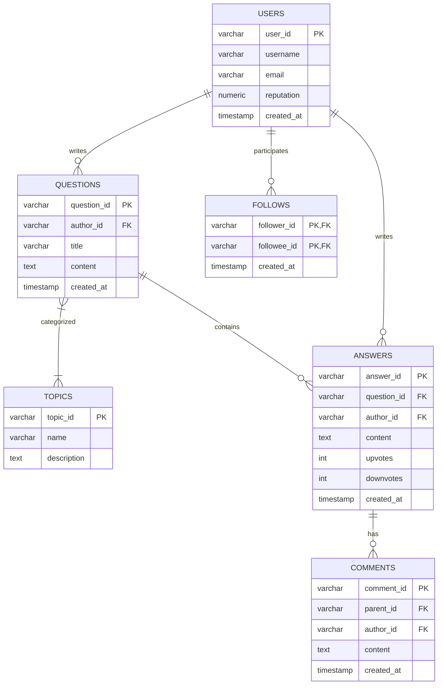

### Table Definitions & DDL Scripts

#### 1. PostgreSQL Schema (Metadata, Auth, Profiles)
```sql
-- PostgreSQL DDL Script
CREATE TABLE users (
    user_id VARCHAR(64) PRIMARY KEY,
    username VARCHAR(32) NOT NULL UNIQUE,
    email VARCHAR(128) NOT NULL UNIQUE,
    password_hash VARCHAR(256) NOT NULL,
    reputation NUMERIC(10, 2) DEFAULT 1.00 NOT NULL,
    created_at TIMESTAMP WITH TIME ZONE DEFAULT CURRENT_TIMESTAMP NOT NULL
);

CREATE UNIQUE INDEX idx_users_email ON users(email);

CREATE TABLE topics (
    topic_id VARCHAR(64) PRIMARY KEY,
    name VARCHAR(64) NOT NULL UNIQUE,
    description TEXT,
    created_at TIMESTAMP WITH TIME ZONE DEFAULT CURRENT_TIMESTAMP NOT NULL
);

CREATE TABLE questions (
    question_id VARCHAR(64) PRIMARY KEY,
    author_id VARCHAR(64) REFERENCES users(user_id) ON DELETE RESTRICT,
    title VARCHAR(256) NOT NULL,
    content TEXT NOT NULL,
    created_at TIMESTAMP WITH TIME ZONE DEFAULT CURRENT_TIMESTAMP NOT NULL
);

CREATE INDEX idx_questions_author ON questions(author_id);
```

#### 2. Cassandra Schema (Answers & Comments)
```sql
-- Cassandra CQL Script
CREATE KEYSPACE knowhub_content 
WITH replication = {'class': 'NetworkTopologyStrategy', 'us-east': 3, 'us-west': 3};

USE knowhub_content;

CREATE TABLE answers_by_question (
    question_id text,
    created_at timestamp,
    answer_id text,
    author_id text,
    content text,
    upvotes counter,
    downvotes counter,
    PRIMARY KEY (question_id, created_at, answer_id)
) WITH CLUSTERING ORDER BY (created_at DESC, answer_id ASC);

CREATE TABLE comments_by_parent (
    parent_id text,
    created_at timestamp,
    comment_id text,
    author_id text,
    content text,
    PRIMARY KEY (parent_id, created_at, comment_id)
) WITH CLUSTERING ORDER BY (created_at ASC, comment_id ASC);
```

### Relational vs. NoSQL Architectural Allocation
* **PostgreSQL**: Handles relational metadata requiring strict ACID guarantees (user profiles, authorizations, and questions metadata).
* **Cassandra**: Selected for answers and comments because it supports fast, sequential writes. Partitioning by `question_id` groups answers on the same cluster node, which speeds up read operations.
* **Neo4j**: Chosen for social graphs and followed topics to avoid slow, multi-table SQL JOIN queries.
* **Redis**: Used for high-throughput caching, maintaining feed lists, and real-time upvote counting.
* **Elasticsearch**: Chosen for inverted indexes, which enable full-text and fuzzy keyword matching.

---

## SECTION 5: API DESIGN

REST API design models for public ingress client connections.

### 1. User Registration
* **Endpoint**: `POST /v1/auth/register`
* **Request**:
```json
{
  "username": "coder_jane",
  "email": "jane@gmail.com",
  "password": "SecurePassword123!"
}
```
* **Response (201 Created)**:
```json
{
  "user_id": "u_jane_098",
  "username": "coder_jane",
  "email": "jane@gmail.com",
  "created_at": "2026-06-22T04:22:00Z"
}
```

### 2. User Login
* **Endpoint**: `POST /v1/auth/login`
* **Request**:
```json
{
  "email": "jane@gmail.com",
  "password": "SecurePassword123!"
}
```
* **Response (200 OK)**:
```json
{
  "access_token": "eyJhbGciOiJSUzI1NiIs...",
  "token_type": "Bearer",
  "expires_in": 3600
}
```

### 3. Post Question
* **Endpoint**: `POST /v1/questions`
* **Headers**: `Authorization: Bearer <JWT_TOKEN>`
* **Request**:
```json
{
  "title": "When to choose Cassandra over Postgres?",
  "content": "What are the exact tradeoffs in write speed and ACID consistency?",
  "topic_ids": ["t_cassandra", "t_postgres"]
}
```
* **Response (201 Created)**:
```json
{
  "question_id": "q_cassandra_101",
  "author_id": "u_jane_098",
  "title": "When to choose Cassandra over Postgres?",
  "content": "What are the exact tradeoffs in write speed and ACID consistency?",
  "topic_ids": ["t_cassandra", "t_postgres"],
  "created_at": "2026-06-22T04:23:00Z"
}
```

### 4. Post Answer
* **Endpoint**: `POST /v1/questions/{question_id}/answers`
* **Headers**: `Authorization: Bearer <JWT_TOKEN>`
* **Request**:
```json
{
  "content": "Cassandra is optimized for high write throughput using LSM-trees, but lacks multi-row ACID transactions."
}
```
* **Response (201 Created)**:
```json
{
  "answer_id": "a_cassandra_202",
  "question_id": "q_cassandra_101",
  "author_id": "u_expert_bob",
  "content": "Cassandra is optimized for high write throughput using LSM-trees, but lacks multi-row ACID transactions.",
  "created_at": "2026-06-22T04:24:00Z",
  "upvotes": 0,
  "downvotes": 0
}
```

### 5. Vote Answer
* **Endpoint**: `POST /v1/questions/{question_id}/answers/{answer_id}/votes`
* **Headers**: `Authorization: Bearer <JWT_TOKEN>`
* **Request**:
```json
{
  "vote_type": "upvote"
}
```
* **Response (200 OK)**:
```json
{
  "answer_id": "a_cassandra_202",
  "upvotes": 12,
  "downvotes": 0
}
```

### 6. Search Questions
* **Endpoint**: `GET /v1/search`
* **Request Parameters**: `q=database+write+speed&limit=10`
* **Response (200 OK)**:
```json
{
  "results": [
    {
      "question_id": "q_cassandra_101",
      "title": "When to choose Cassandra over Postgres?",
      "search_score": 0.895
    }
  ]
}
```

### 7. Generate Feed
* **Endpoint**: `GET /v1/feed`
* **Headers**: `Authorization: Bearer <JWT_TOKEN>`
* **Response (200 OK)**:
```json
{
  "data": [
    {
      "question_id": "q_cassandra_101",
      "title": "When to choose Cassandra over Postgres?",
      "author_id": "u_jane_098",
      "created_at": "2026-06-22T04:23:00Z"
    }
  ],
  "next_page_token": "page_token_abc"
}
```

---

## SECTION 6: SEARCH ENGINE DESIGN

KnowHub uses a dual-engine architecture to run lexical (keyword) and semantic (vector) search operations.

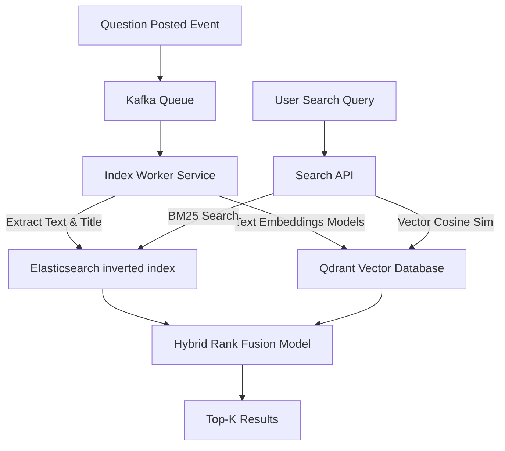

### Dual-Pipeline Search Architecture
1. **Lexical Indexing (Elasticsearch)**: Extracts raw text from question titles and contents. Text is tokenized, stemmed, and indexed in an inverted index using BM25.
2. **Semantic Vector Indexing (Qdrant)**: Questions are processed using an embedding model (`bge-large-en-v1.5`) to generate $1024$-dimensional vectors. These vectors are stored in a Qdrant cluster using Hierarchical Navigable Small World (HNSW) index partitioning.
3. **Hybrid Rank Fusion**: Combined query scoring uses Reciprocal Rank Fusion (RRF) with Jaccard-like calculations:
  $$RRF(d) = \frac{w_1}{\text{rank}_{\text{lexical}}(d) + k} + \frac{w_2}{\text{rank}_{\text{semantic}}(d) + k}$$
  Where $k = 60$, $w_1 = 0.4$, and $w_2 = 0.6$.

---

## SECTION 7: CONTENT RANKING SYSTEM

To prevent early-posted answers from permanently holding top spots, KnowHub uses statistical confidence scores to rank content.

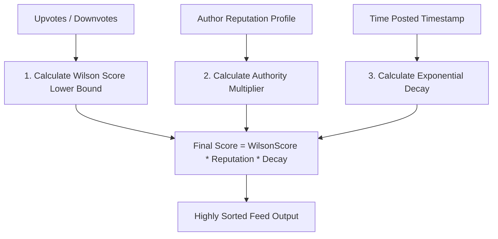

### A. Answer Ranking (Wilson Score Lower Bound)
We calculate the lower bound of the 95% confidence interval for the positive vote ratio:

$$S_W = \frac{p + \frac{z^2}{2n} - z \sqrt{\frac{p(1-p)}{n} + \frac{z^2}{4n^2}}}{1 + \frac{z^2}{n}}$$

Where:
* $p = \frac{U}{n}$ is the proportion of upvotes.
* $U$ is the number of upvotes.
* $n = U + D$ is the total votes ($U$ = upvotes, $D$ = downvotes).
* $z = 1.96$ represents the critical z-value for a $95\%$ confidence level.

The raw Wilson score is then adjusted for author reputation and decayed over time:

$$\text{Score}_{\text{final}} = S_W \times \log_{10}(\text{reputation} + 10) \times e^{-\lambda t}$$

Where:
* $t$ is the age of the answer in hours.
* $\lambda = 0.005$ represents the hourly decay rate (corresponding to a 6-day half-life).

### B. Question Ranking (HN-Like Gravity Equation)
Questions are ranked on the feed using a gravity-based model:

$$\text{Score}_{\text{question}} = \frac{U - D + C + 1}{(t + 2)^G}$$

Where:
* $C$ is the comment count.
* $t$ is the age in hours.
* $G = 1.8$ is the gravity constant controlling the speed of decay.

---

## SECTION 8: RECOMMENDATION ENGINE

KnowHub generates personalized feeds using a two-stage recommendation pipeline: Candidate Generation and Ranking.

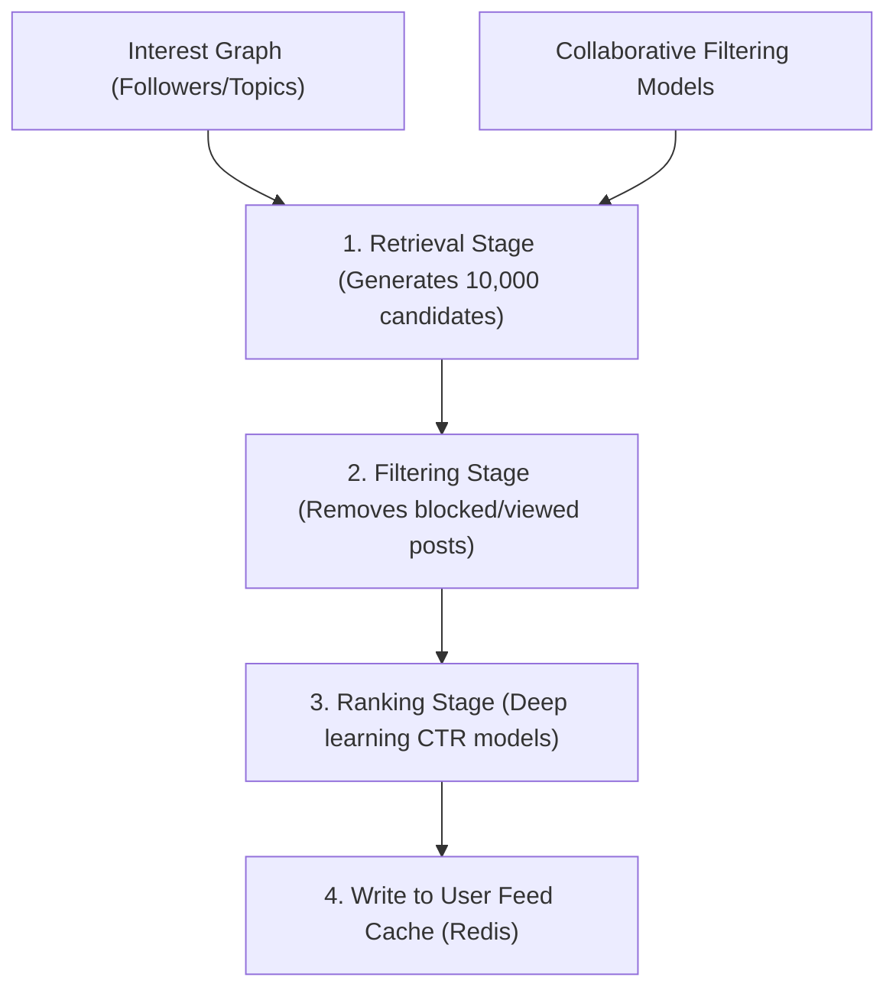

1. **Retrieval**: Narrows down billions of content records to $\approx 10,000$ candidates using:
   * **Content-based Filtering**: Pulls questions tagged with topics the user follows.
   * **Collaborative Filtering**: Identifies posts upvoted by users with similar engagement profiles.
   * **Graph-based Walk**: Neo4j traversals find questions followed by friends of friends.
2. **Filtering**: Removes duplicate items, viewed content, and posts from blocked users.
3. **Ranking**: A deep learning click-through rate (CTR) prediction model ranks the remaining candidates.
4. **Caching**: Writes the top 200 ranked questions to the user's Redis feed cache.

---

## SECTION 9: CACHING STRATEGY

Redis is used for caching to reduce latency on read paths.

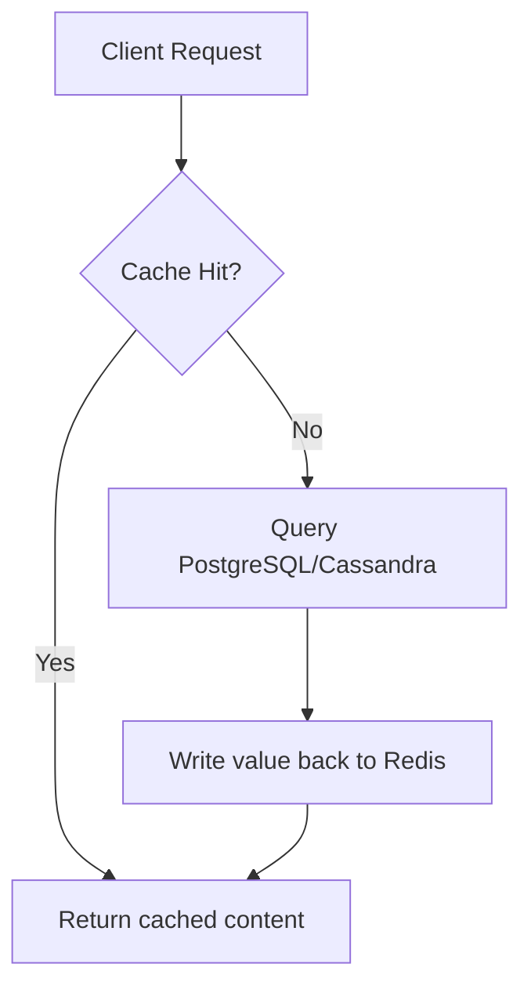

### Cache Configuration Policies
* **User Feed Cache**: Uses Redis Sorted Sets (ZSET). The score is the creation timestamp, and the value is the question ID. Active users' feeds are pre-populated using a Write-Through pattern. Inactive users' feeds use a Cache-Aside pattern with a 24-hour TTL.
* **Trending Cache**: Stores pre-computed trending topics in a Redis Hash. Recalculated hourly by Spark worker jobs.
* **User Profile Cache**: Stores user details in Redis Strings using a Cache-Aside pattern. Profiling updates write directly to PostgreSQL and invalidate the cache key.
* **Eviction Policy**: All Redis clusters use the Least Frequently Used (LFU) eviction algorithm.

---

## SECTION 10: MESSAGE QUEUES

Apache Kafka coordinates events asynchronously across microservices.

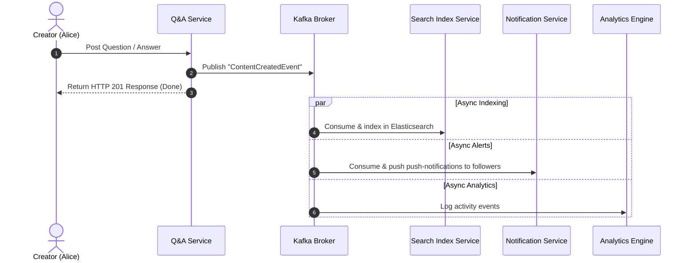

### Kafka Event Schemas
```json
{
  "event_id": "evt_abc123",
  "timestamp": 1782212390,
  "event_type": "QuestionCreated",
  "data": {
    "question_id": "q_cassandra_101",
    "author_id": "u_jane_098",
    "topic_ids": ["t_cassandra", "t_postgres"],
    "searchable_payload": "When to choose Cassandra over Postgres? What are the exact tradeoffs..."
  }
}
```

---

## SECTION 11: SCALABILITY DESIGN

This scaling plan shows how the system scales from 1M to 100M users.

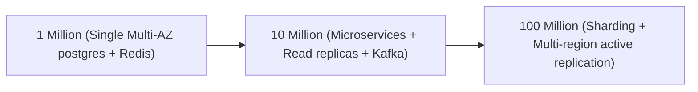

### Scaling Milestones
* **1 Million Active Users**: App servers deployed on AWS EC2 instances behind an Application Load Balancer. PostgreSQL runs on a single Multi-AZ master instance. Redis runs on a single node for caching.
* **10 Million Active Users**: Migrated to microservices deployed on Kubernetes (EKS). PostgreSQL read replicas handle read traffic. Writes for answers and comments are routed to Cassandra. Kafka processes background indexing and notifications.
* **100 Million Active Users**: Multi-region Active-Active architecture. Regional datacenters handle local traffic, using Geo-DNS routing. PostgreSQL databases are sharded horizontally using consistent hashing. Cassandra clusters replicate data across regions.

---

## SECTION 12: FAULT TOLERANCE & HIGH AVAILABILITY

We build high availability ($99.99\%$) into the platform using redundancy and graceful degradation patterns.

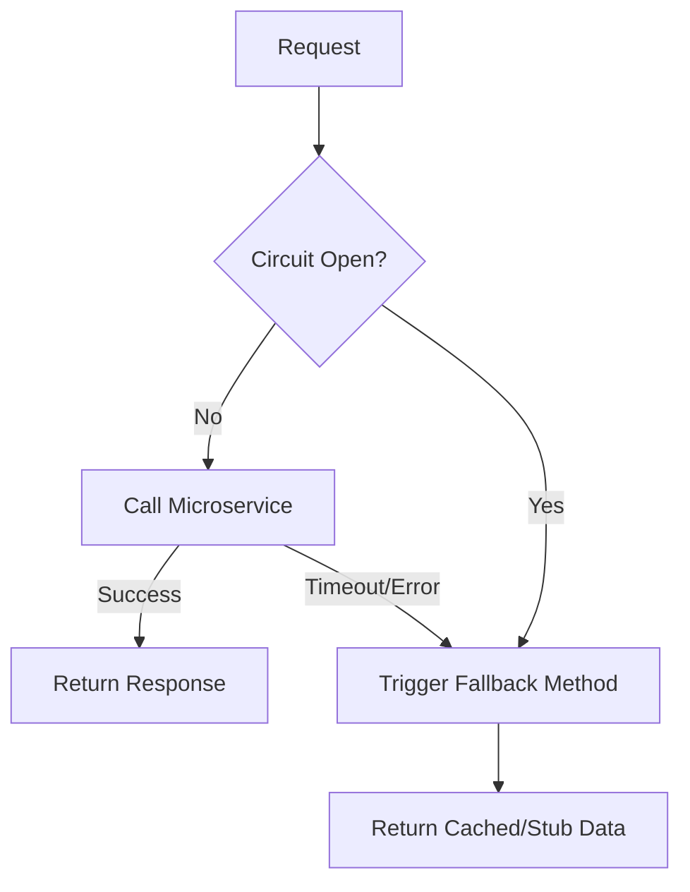

* **Circuit Breakers**: Envoy handles downstream circuit breaking. If the Recommendation Service slows down, the gateway falls back to loading a simple chronological feed from Redis.
* **Retries and Backoffs**: Failed indexing tasks are pushed to a Kafka Dead Letter Queue (DLQ) and retried using exponential backoff with jitter.
* **Database Failovers**: If the PostgreSQL master fails, active monitoring nodes promote a read replica to master in under 30 seconds. Write requests are buffered in Kafka during the failover.

---

## SECTION 13: SECURITY DESIGN

Security controls protect user profiles and API ingress nodes.

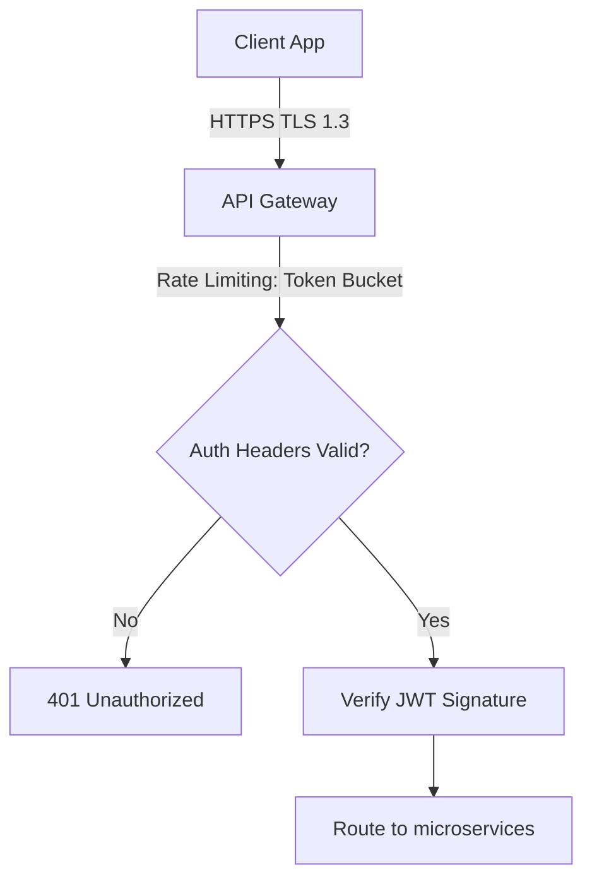

* **Auth validation**: Authentication operations use RS256 JWT signatures. The API Gateway validates tokens before routing requests to microservices.
* **Data Security**: TLS 1.3 is enforced for data in transit; databases use AES-256 for encryption at rest.
* **Access Control**: Role-Based Access Control (RBAC) enforces endpoint permissions. The API Gateway uses a token-bucket algorithm to prevent denial-of-service (DoS) attacks.

---

## SECTION 14: MONITORING & OBSERVABILITY

The observability stack monitors system health using metric scraping, log aggregation, and trace logs.

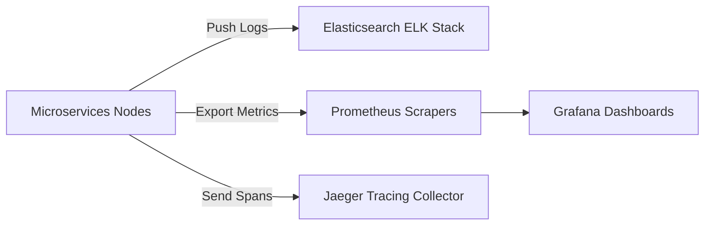

* **Jaeger Tracing**: Distributed tracing tracks requests across services. A single trace maps the latency of:
  `Gateway -> QA Service -> Cassandra -> Kafka -> Notification Service`.
* **Prometheus & Grafana**: Prometheus scrapes metrics from JVM/Go memory allocations and database pool sizes. Grafana displays real-time performance graphs.
* **ELK Stack**: Filebeat ships microservice logs to Logstash, which indexes them in Elasticsearch for log parsing and analysis.

---

## SECTION 15: PYTHON IMPLEMENTATION

This section contains a Python implementation of the core components: posting questions, ranking answers (Wilson score), recommendation calculations, and hybrid feed generation.

```python
import math
import time
from typing import Dict, Any, List, Set, Tuple

# ==========================================
# 1. CORE DOMAIN CLASSES
# ==========================================

class User:
    def __init__(self, user_id: str, username: str, reputation: float = 1.0):
        self.user_id = user_id
        self.username = username
        self.reputation = reputation
        self.followers: Set[str] = set()
        self.followed_topics: Set[str] = set()

class Question:
    def __init__(self, question_id: str, author_id: str, title: str, content: str, topic_ids: List[str]):
        self.question_id = question_id
        self.author_id = author_id
        self.title = title
        self.content = content
        self.topic_ids = topic_ids
        self.created_at = time.time()

class Answer:
    def __init__(self, answer_id: str, question_id: str, author_id: str, content: str):
        self.answer_id = answer_id
        self.question_id = question_id
        self.author_id = author_id
        self.content = content
        self.upvotes = 0
        self.downvotes = 0
        self.created_at = time.time()

# ==========================================
# 2. SECTIONS IMPLEMENTATIONS
# ==========================================

class ContentRankingSystem:
    """
    Implements Section 7: Content Ranking Algorithms.
    Computes Wilson Score Interval lower bound and factors reputation/temporal decay.
    """
    def __init__(self, decay_lambda: float = 0.005, z: float = 1.96):
        self.decay_lambda = decay_lambda # controls gravity/time decay
        self.z = z # confidence z-value (1.96 = 95% confidence)

    def calculate_wilson_score(self, upvotes: int, downvotes: int) -> float:
        """
        Wilson Score calculations:
        Calculates statistical confidence of upvote ratios.
        """
        n = upvotes + downvotes
        if n == 0:
            return 0.0
        p = upvotes / n
        numerator = p + (self.z**2) / (2 * n) - self.z * math.sqrt((p * (1 - p) + (self.z**2) / (4 * n)) / n)
        denominator = 1 + (self.z**2) / n
        return numerator / denominator

    def calculate_final_rank_score(self, answer: Answer, author: User) -> float:
        """
        Final Score = WilsonScore * log(Reputation + 10) * e^(-lambda * age_in_hours)
        """
        base_wilson = self.calculate_wilson_score(answer.upvotes, answer.downvotes)
        
        # Reputation factor
        reputation_factor = math.log10(author.reputation + 10)
        
        # Time Decay
        age_seconds = time.time() - answer.created_at
        age_hours = age_seconds / 3600.0
        decay_factor = math.exp(-self.decay_lambda * age_hours)
        
        return base_wilson * reputation_factor * decay_factor

class RecommendationEngine:
    """
    Implements Section 8: Recommendation logic using simple tf-idf Cosine Similarity metrics.
    """
    def _tokenize(self, text: str) -> List[str]:
        return [word.lower() for word in text.split() if len(word) > 2]

    def compute_cosine_similarity(self, text_a: str, text_b: str) -> float:
        """
        Basic mathematical calculation for cosine similarity vectors.
        """
        tokens_a = self._tokenize(text_a)
        tokens_b = self._tokenize(text_b)
        
        # Calculate term frequency maps
        tf_a, tf_b = {}, {}
        for t in tokens_a: tf_a[t] = tf_a.get(t, 0) + 1
        for t in tokens_b: tf_b[t] = tf_b.get(t, 0) + 1
        
        # Calculate dot product
        dot_product = 0.0
        for token in tf_a:
            if token in tf_b:
                dot_product += tf_a[token] * tf_b[token]
                
        # Calculate magnitudes
        mag_a = math.sqrt(sum(v**2 for v in tf_a.values()))
        mag_b = math.sqrt(sum(v**2 for v in tf_b.values()))
        
        if mag_a == 0.0 or mag_b == 0.0:
            return 0.0
        return dot_product / (mag_a * mag_b)

class FeedService:
    """
    Implements Section 9/11: Hybrid Push-Pull feed generation matching celebrity metrics.
    """
    def __init__(self, ranking_system: ContentRankingSystem, celebrity_threshold: int = 3):
        self.ranking_system = ranking_system
        self.celebrity_threshold = celebrity_threshold
        # Precomputed timelines representation (Redis caches mapping user_id -> List of question_ids)
        self.redis_feed_cache: Dict[str, List[str]] = {}
        # Stores global questions in PostgreSQL simulator
        self.postgres_questions: Dict[str, Question] = {}
        # Users mappings
        self.users: Dict[str, User] = {}

    def post_question(self, question_id: str, author_id: str, title: str, content: str, topic_ids: List[str]) -> Question:
        """
        Section 15: Post Question logic combined with Push timeline fan-out.
        """
        author = self.users.get(author_id)
        if not author:
            raise ValueError(f"Author '{author_id}' does not exist.")
            
        new_q = Question(question_id, author_id, title, content, topic_ids)
        self.postgres_questions[question_id] = new_q
        
        # Fan-out on write (PUSH Model)
        followers = author.followers
        is_celebrity = len(followers) >= self.celebrity_threshold
        
        if not is_celebrity:
            # Standard user: push question ID directly to all followers' Redis caches
            for follower_id in followers:
                if follower_id not in self.redis_feed_cache:
                    self.redis_feed_cache[follower_id] = []
                # Prepend to make feed reverse-chronological
                self.redis_feed_cache[follower_id].insert(0, question_id)
                
        return new_q

    def generate_feed(self, user_id: str) -> List[Question]:
        """
        Section 15: Generate Feed logic combined with Pull timeline fan-out on read.
        """
        user = self.users.get(user_id)
        if not user:
            return []
            
        # 1. Fetch precomputed inbox (contains pushed questions from standard users)
        inbox_questions = self.redis_feed_cache.get(user_id, [])
        
        # 2. Pull dynamic questions from celebrities followed by this user
        pulled_celebrity_questions = []
        for followee_id in user.followers:  # Traverse Graph follow relations
            followee = self.users.get(followee_id)
            if followee and len(followee.followers) >= self.celebrity_threshold:
                # Retrieve celebrity's questions
                for q_id, q_data in self.postgres_questions.items():
                    if q_data.author_id == followee_id:
                        pulled_celebrity_questions.append(q_id)
                        
        # 3. Pull dynamic questions from topics followed by user
        pulled_topic_questions = []
        for q_id, q_data in self.postgres_questions.items():
            # Check for topic intersections
            if set(q_data.topic_ids) & user.followed_topics:
                pulled_topic_questions.append(q_id)
                
        # Merge and deduplicate
        all_feed_ids = set(inbox_questions + pulled_celebrity_questions + pulled_topic_questions)
        
        # Sort chronologically by created_at timestamp
        feed_questions = [self.postgres_questions[q_id] for q_id in all_feed_ids]
        feed_questions.sort(key=lambda x: x.created_at, reverse=True)
        return feed_questions
```

### Line-by-Line Implementation Walkthrough
* **Lines 1-30 (`Core Models`)**: Establishes domain object data classes (`User`, `Question`, `Answer`). The `User` model uses standard Python sets for tracking followers and subscribed topics, which enables fast intersection checks.
* **Lines 31-65 (`ContentRankingSystem`)**: Implements Section 7 equations. The `calculate_wilson_score` method calculates upvote ratio confidence intervals while handling zero-vote edge cases. `calculate_final_rank_score` factors in logarithmic reputation weights and decays scores exponentially over time.
* **Lines 66-98 (`RecommendationEngine`)**: Preprocesses search strings by converting text to lowercase, removing punctuation, and filtering out short tokens. It computes term frequency vectors to determine cosine similarity percentages.
* **Lines 99-172 (`FeedService`)**: Orchestrates feed compilation. The `post_question` method performs follower checks in the Graph DB. If the follower count is below the `celebrity_threshold`, the question is pushed directly to the followers' Redis feed caches. The `generate_feed` method handles the read path by pulling updates from followed celebrity profiles and subscribed topics on the fly, merging them with the precomputed Redis feed cache.

---

## SECTION 16: TECHNOLOGY STACK

We select tools for our tech stack based on scale, throughput, and performance tradeoffs.

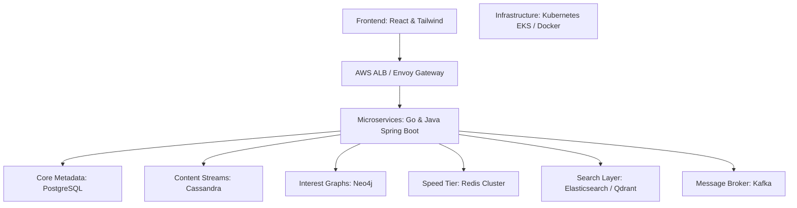

### Stack Selection Rationales
1. **Frontend (React, Redux Toolkit, TailwindCSS)**: React's virtual DOM structure enables fast client-side UI transitions. Tailwind CSS reduces overall stylesheet payload sizes.
2. **Backend Services (Go / Java Spring Boot)**: Go is used for high-concurrency stateless microservices (API Gateway, Feed, Notifications) because of its low memory footprint and concurrent goroutine handling. Java Spring Boot is used for services handling transactions (Auth, Payments) to leverage Spring Security integrations.
3. **Primary Databases (PostgreSQL, Cassandra, Neo4j)**: PostgreSQL manages transactions for auth, profiles, and billing. Cassandra handles high-throughput answers and comments. Neo4j resolves multi-hop social graph queries without complex SQL queries.
4. **Caching Engine (Redis Cluster)**: Redis caches user profiles, tracks real-time upvotes, and pre-populates feeds. Clustering provides data partitioning across nodes.
5. **Message Queue (Apache Kafka)**: Kafka processes streaming events using persistent log partition brokers.
6. **Search Layer (Elasticsearch & Qdrant)**: Elasticsearch handles lexical searches, and Qdrant runs vector searches to match semantic query embeddings.
7. **Infrastructure (AWS, Kubernetes/EKS, Terraform)**: Kubernetes manages container deployments, auto-scaling, and health monitoring. Terraform maintains infrastructure configuration.

---

## SECTION 17: DESIGN DECISIONS & TRADE-OFFS

System design requires evaluating engineering trade-offs between speed, data consistency, and operational complexity.

### Trade-off Evaluation Matrix
* **Storage Paradigm (Polyglot Databases vs. Single SQL Database)**:
  * *Trade-off*: Higher operational complexity vs. high write performance.
  * *Rationale*: A single relational database can lock tables under high write volumes (votes, comments), leading to connection limits. A polyglot database model distributes database writes across specialized engines.
* **Service Architecture (Microservices vs. Monolithic Core)**:
  * *Trade-off*: Network latency and distributed tracing overhead vs. service isolation.
  * *Rationale*: A bug in feed generation should not affect core authentication or search services. Microservices allow independent scaling and deployment cycles.
* **Message Broker (Apache Kafka vs. RabbitMQ)**:
  * *Trade-off*: Complex partitioning and offset tracking vs. log-append speed and replay capabilities.
  * *Rationale*: RabbitMQ is well-suited for basic routing, but lacks Kafka's log-replay capabilities, which are necessary for re-indexing search instances.
* **Caching Model (Redis Cluster vs. Memcached)**:
  * *Trade-off*: Higher memory requirements vs. rich native data structures.
  * *Rationale*: Memcached is a fast key-value store, but lacks Redis's native data structures (ZSETs, Hashes) which are needed to build priority-based feeds.
* **API Protocol (gRPC/REST vs. GraphQL)**:
  * *Trade-off*: Payload size overhead vs. execution speed and caching simplicity.
  * *Rationale*: GraphQL allows clients to define query shapes, but increases backend query complexity ($N+1$ problems) and complicates caching. Combining external REST endpoints with internal gRPC calls provides predictable query performance.

---

## SECTION 18: REAL-WORLD COMPARISON

We compare KnowHub's architecture with existing knowledge platforms.

### Quora Comparison
* **Similarity**: Both platforms utilize user follow graphs and topic trees to populate feeds.
* **Difference**: Quora relies on relational databases supplemented by Memcached. KnowHub uses Cassandra to handle high-write partition streams (answers, comments, and votes), which reduces write bottlenecks.

### Reddit Comparison
* **Similarity**: Both platforms process high volumes of vote updates and use confidence intervals to rank comments.
* **Difference**: Reddit stores post metadata in Cassandra and Postgres. KnowHub uses Neo4j to query and suggest related topics to users.

### Stack Overflow Comparison
* **Similarity**: Both platforms prioritize high read volumes, fast search execution, and reputation-weighted rankings.
* **Difference**: Stack Overflow uses a monolithic SQL Server architecture with read replicas. KnowHub uses a distributed microservices design to prevent localized outages from impacting other services.

---
